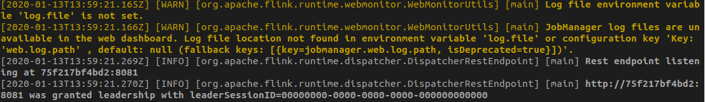
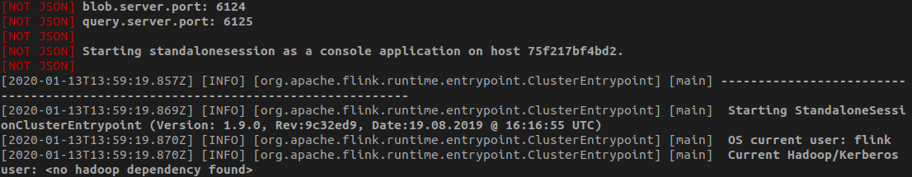

# Jaslog

](https://crates.io/crates/jaslog)


A log reader for structured logs that handles non-json lines, displays beautifully
colored logs and can filter based on the fields of the json.





- non-json lines will be displayed but marked clearly
- filters work for any fields, even fields that are not recognized
- if the structure of the JSON is not recognized, all the field will be shown on the log line
- there is no way to control which fields are displayed
- there is no way to control the formatting

It will work especially well with certain specific JSON structures (see "Supported formats").

## Install

### Using cargo install

```bash
cargo install jaslog
```

### Using pre-built binaries

1. Download the binary from the [latest release](https://github.com/jbruggem/jaslog/releases)
2. Put it in the folder that's part of your PATH
3. Make it executable (`chmod +x`)

## Usage


Basic usage:

```sh
$ jaslog file.json.log
```

Or using stdin:

```sh
$ cat file.json.log | jaslog
```

### CLI parameters

```
USAGE:
    jaslog [OPTIONS] [--] [input_file]

ARGS:
    <input_file>    Input file to read

OPTIONS:
    -f, --filter <filters>           Filter the logs. Example:  -f app=this -f module=+Drive (use
                                     '+' to search within the field, use '^' to exclude within the
                                     field)
    -h, --help                       Print help information
    -n, --lines <number_of_lines>    Number of lines to read.
    -V, --version                    Print version information
```

To filter, the syntax is:

* `<field>=<value>`: search for exact value of field
* `<field>=+<value>`: search for value in field (suggestions of a better syntax are welcome :-P)
* `<field>=^<value>`: search for **absence** of value in field (suggestions of a better syntax are welcome :-P)

```sh
$ jaslog file.json.log -f level=info
```

You can also can also ask to read only the first n lines:

```sh
$ jaslog file.json.log -f level=info -n 50
```

## Explicitly supported formats

Pull requests to support new formats are welcome of course !

Elixir logs:

```json
{
  "app": "ecto_sql",
  "level": "info",
  "message": "create index etc...",
  "metadata": {},
  "module": "Elixir.Ecto.Migration.Runner",
  "pid": "#PID<0.280.0>",
  "timestamp": "2019-12-18T10:55:50.000393"
}
```

Logstash's jsonevent-layout logs:

```json
{
  "@timestamp": "2020-01-13T12:34:01.740Z",
  "source_host": "04fc4fd30dc3",
  "file": "Dispatcher.java",
  "method": "tryAcceptLeadershipAndRunJobs",
  "level": "DEBUG",
  "line_number": "927",
  "thread_name": "flink-akka.actor.default-dispatcher-3",
  "@version": 1,
  "logger_name": "org.apache.flink.runtime.dispatcher.StandaloneDispatcher",
  "message": "Dispatcher akka.tcp://flink@04fc4fd30dc3:6123/user/dispatcher accepted leadership with fencing token 00000000000000000000000000000000. Start recovered jobs.",
  "class": "org.apache.flink.runtime.dispatcher.Dispatcher",
  "mdc": {}
  }
```

Log4J's JSONLayout logs:

```json
{
  "thread": "main",
  "level": "INFO",
  "loggerName": "org.apache.flink.runtime.dispatcher.DispatcherRestEndpoint",
  "message": "Starting rest endpoint.",
  "endOfBatch": false,
  "loggerFqcn": "org.apache.logging.slf4j.Log4jLogger",
  "instant": {
    "epochSecond": 1622724607,
    "nanoOfSecond": 420000000
  },
  "threadId": 1,
  "threadPriority": 5
}
```

### Releasing

* Update version in Cargo.toml
* Commit
* tag with `v<version>`, then push
* run `cargo publish`
